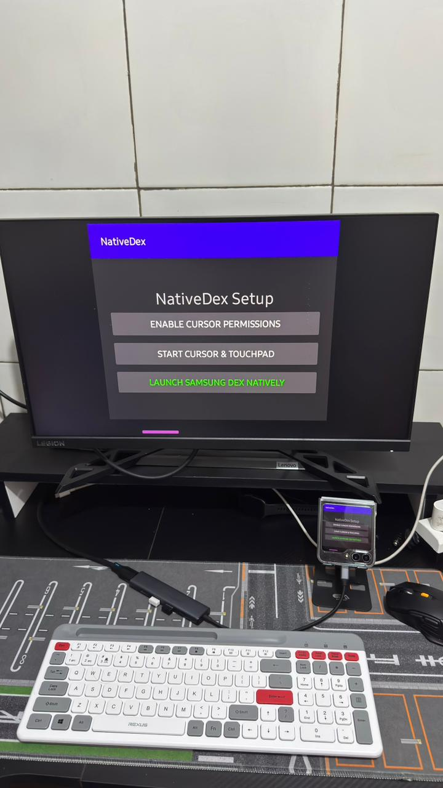
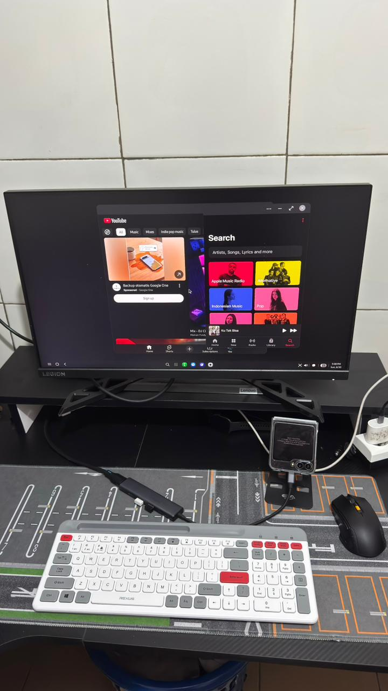
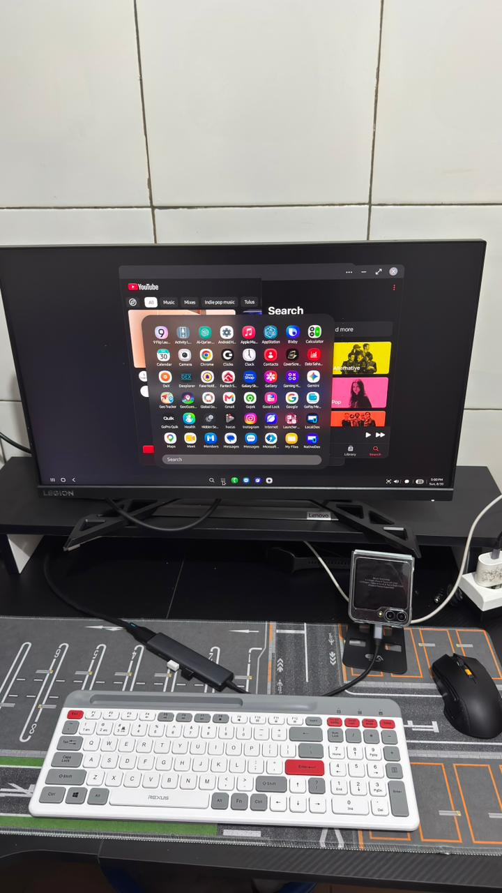

# NativeDex

> Make zFlip 5 great again

NativeDex is a utility that unlocks Samsung DeX **natively** on your device, without the need for ADB, Root, Shizuku, Virtual Display or USB Debugging!

Currently tested on a **Galaxy Z Flip 5 running One UI 8.0 (Android 16)**.

  
  
  

## Requirements

1. A secondary display/monitor with a USB Type-C to HDMI hub.
2. A Galaxy Z Flip 5 running One UI 8.0 or above. _(Feel free to test on other Samsung devices with different One UI versions!)_

## Installation & Setup Guide

Follow these steps carefully to set up NativeDex on your device:

1. **Download NativeDex:** Download the latest APK from the [Releases page](https://github.com/alghiffaryfa19/dex-dp/releases).
2. **Install:** Install the downloaded APK on your device.
3. **Grant Overlay Permission:** Open the app and activate the "Appear on top" (Draw over other apps) permission.
4. **Return to the App:** Go back to the NativeDex application.
5. **Enable Cursor Permissions:** Tap on the "Enable Cursor Permissions" button.
6. **Bypass Restricted Settings:**
   - Tap on `Installed apps` -> `NativeDex`.
   - A pop-up saying "Restricted setting" or "App was denied access" will appear. Tap **Close**.
7. **Allow Restricted Settings:**
   - Go to your phone's **Settings** -> **Apps** -> **NativeDex**.
   - Tap the 3-dot menu icon in the top right corner.
   - Select **Allow restricted settings**.
8. **Activate Accessibility:**
   - Return to the NativeDex app.
   - Tap "Enable Cursor Permissions" again.
   - Go to `Installed apps` -> `NativeDex` and turn it **ON**.
9. **Connect Your Display:** Return to the NativeDex app, then connect your phone to your external monitor using the HDMI hub.
10. **Verify Connection:** Ensure your phone's screen is mirrored or displayed on the secondary monitor.
11. **Launch DeX:** Tap the **"Launch Samsung DeX Natively"** button.
12. **Enjoy Your Built-in Touchpad:** Due to restrictions placed by Samsung, a physical mouse cursor cannot directly appear inside DeX on this device model. To overcome this, NativeDex features a built-in, multi-touch virtual touchpad and physical mouse emulation!

## Contributing & Issues

Found a bug or have a great feature idea? I welcome all contributions and feedback! Feel free to open an issue or submit a pull request.
